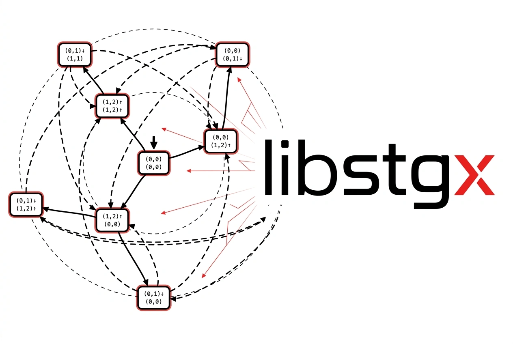

<div align="center">



[](https://github.com/peplxx/libstgx/actions/workflows/ci.yml)


</div>

**S**tate **T**ransition **G**raph e**X**tended — a C++ library for building, editing and
validating state-transition graphs of schedules for real-time systems.

---

libstgx reads and writes the YAML that
[state-graph-visualizer](https://github.com/peplxx/state-graph-visualizer) renders, and is the
source of truth for that format — it validates stricter than the viewer does.


## Add to project

```cmake
include(FetchContent)

FetchContent_Declare(
  libstgx
  GIT_REPOSITORY https://github.com/peplxx/libstgx.git
  GIT_TAG        v0.1.0
  GIT_SHALLOW    TRUE
)
FetchContent_MakeAvailable(libstgx)

target_link_libraries(my_app PRIVATE stgx::stgx)
```

**As a subdirectory** — submodule or vendored copy:

```cmake
add_subdirectory(libstgx)
target_link_libraries(my_app PRIVATE stgx::stgx)
```

There is no `install()` / `find_package(stgx)` yet — both routes above go through
`add_subdirectory`.

## Building the library itself

```bash
cmake -B build -S . -DCMAKE_BUILD_TYPE=Debug
cmake --build build -j
ctest --test-dir build --output-on-failure
```

CMake 3.21+ and a C++23 compiler (Apple Clang 17, GCC 13, Clang 17). Catch2 v3 is used for tests —
taken from the system if present, otherwise fetched.

| Option | Default | |
|---|---|---|
| `STGX_BUILD_TESTS` | on for a top-level build, off as a subproject | build the Catch2 test binary |
| `STGX_BUILD_EXAMPLES` | `OFF` | build the two example programs |
| `STGX_ENABLE_CLANG_TIDY` | `OFF` | run clang-tidy over the library sources |

## Graphs and the visualizer format

Everything below is the half of libstgx that faces
[state-graph-visualizer](https://github.com/peplxx/state-graph-visualizer): a model of the picture
— states, transitions, styling — and the YAML document the viewer reads.

<details>
<summary><b>The API and the wire format</b></summary>

<br>

### Usage

```cpp
#include <print>

#include <stgx/stgx.hpp>

int main() {
  auto graph = stgx::GraphBuilder()
      .system([](auto& s) { s.description("EDF").m(1).task(2, 5, "τ₁").task(3, 7, "τ₂"); })
      .node("n00", [](auto& n) { n.initial().task(0, 0).task(0, 0).to("n10").to("n20"); })
      .node("n10", [](auto& n) { n.task(2, 5, stgx::Release::Up).task(0, 0).to("n20"); })
      .node("n20", [](auto& n) { n.task(0, 3, stgx::Release::Down).task(0, 0).loop_to("n00"); })
      .build();

  if (!graph) {
    std::println("{}", graph.error().to_string());
    return 1;
  }
  if (auto saved = stgx::save_yaml_file(*graph, "graph.yaml"); !saved) {
    std::println("{}", saved.error().to_string());
    return 1;
  }
}
```
> Graph is not checked until `build()`, which then reports everything that is wrong at once


```cpp
stgx::Diagnostics warnings;
auto graph = stgx::load_yaml_file("graph.yaml", &warnings);
if (!graph) return std::println("{}", graph.error().to_string()), 1;
if (!warnings.empty()) std::println("{}", warnings.to_string());  // fields we drop when saving
```
> Reading one back. Warnings cannot ride along in `expected`'s success case, so loading takes an
optional `Diagnostics*` for them

## Model

| Type | Holds |
|---|---|
| `System` | `description`, `m` (processor count), `tasks` — the `(c, d)` parameters, one per task |
| `Node` | `id`, `initial`, `label`, `border_color`, `fill_color`, `tasks` — per-task `(c, d, release)` state |
| `Edge` | `source`, `target`, `kind`: `Transition` (`children`) or `Release` (`loopback`) |

`Graph` owns nodes and edges and keeps them indexed: `find_node`, `has_node`, `initial_node`, and
`out_edges(id)` — which returns a `std::span` into the edge storage, no copies. Edges stay grouped
by source, so every mutation re-groups them in O(V+E); deliberate, and fine at the sizes these
graphs come in.

<details>
<summary><b>Mutations</b> — each one keeps the graph referentially sound</summary>

`add_node`, `remove_node`, `rename_node`, `add_edge`, `remove_edge`, `set_initial`,
`set_node_tasks`, `set_node_label`, `set_node_border_color`, `set_node_fill_color`.

Removing a node takes every edge touching it with it; renaming one repoints them. A dangling edge
cannot be produced through this API.

</details>

<details>
<summary><b>Diagnostic codes</b> — <code>{code, severity, path, message}</code></summary>

| Code | Meaning |
|---|---|
| `yaml_parse` | the bytes are not YAML, or the document is empty |
| `wrong_type` | a value has the wrong YAML shape (mapping expected, etc.) |
| `schema_version` | `schemaVersion` is not a version this build reads |
| `nodes_missing` | `nodes` is absent or empty |
| `node_id_empty` / `node_id_duplicate` | node ids must be present and unique |
| `dangling_edge` | an edge names a node that does not exist |
| `initial_count` | `initial` must be set on exactly one node |
| `task_arity_mismatch` | a node has a different number of tasks than `system.tasks` |
| `not_an_int` | `c`, `d`, `m`, `schemaVersion` must be plain integers — `2.0` and `2e1` are not |
| `bad_release` | `release` is not `up` / `down` / `none` (or `↑` / `↓` / `1` / `-1`) |
| `unsupported_field` | recognised but not modelled yet; dropped on save *(warning)* |
| `unknown_field` | not part of the wire format *(warning)* |
| `io_error` | a file could not be opened, read or written |

One `load_yaml_file` on a badly broken document reports the bad integer *and* the dangling edge
*and* the missing initial node.

</details>

## Wire format

```yaml
schemaVersion: 1
system:
  description: EDF feasibility graph
  m: 1
  tasks:
    - {c: 2, d: 5, name: τ₁}
    - {c: 3, d: 7, name: τ₂}
nodes:
  - id: n00
    initial: true
    tasks:
      - {c: 0, d: 0}
      - {c: 0, d: 0}
    children: [n10, n20]
  - id: n10
    tasks:
      - {c: 2, d: 5, release: up}
      - {c: 0, d: 0}
    children: [n20]
  - id: n20
    label: "custom: label"
    borderColor: "#C0392B"
    fillColor: "#F9D5D3"
    tasks:
      - {c: 0, d: 3, release: down}
      - {c: 0, d: 0}
    loopback: [n00]
```

**On read** — `schemaVersion` may be omitted (assumed 1); `isInitial` is accepted as a legacy
spelling of `initial`; `release` accepts `↑` / `1` for up and `↓` / `-1` for down; absent fields
take their defaults.

**On write** — key order is as above, and defaults are omitted: `initial: false`, empty `tasks` /
`children` / `loopback`, `release: none`, absent `label` and colours. Colours are passed through
verbatim, any CSS value the viewer accepts.
